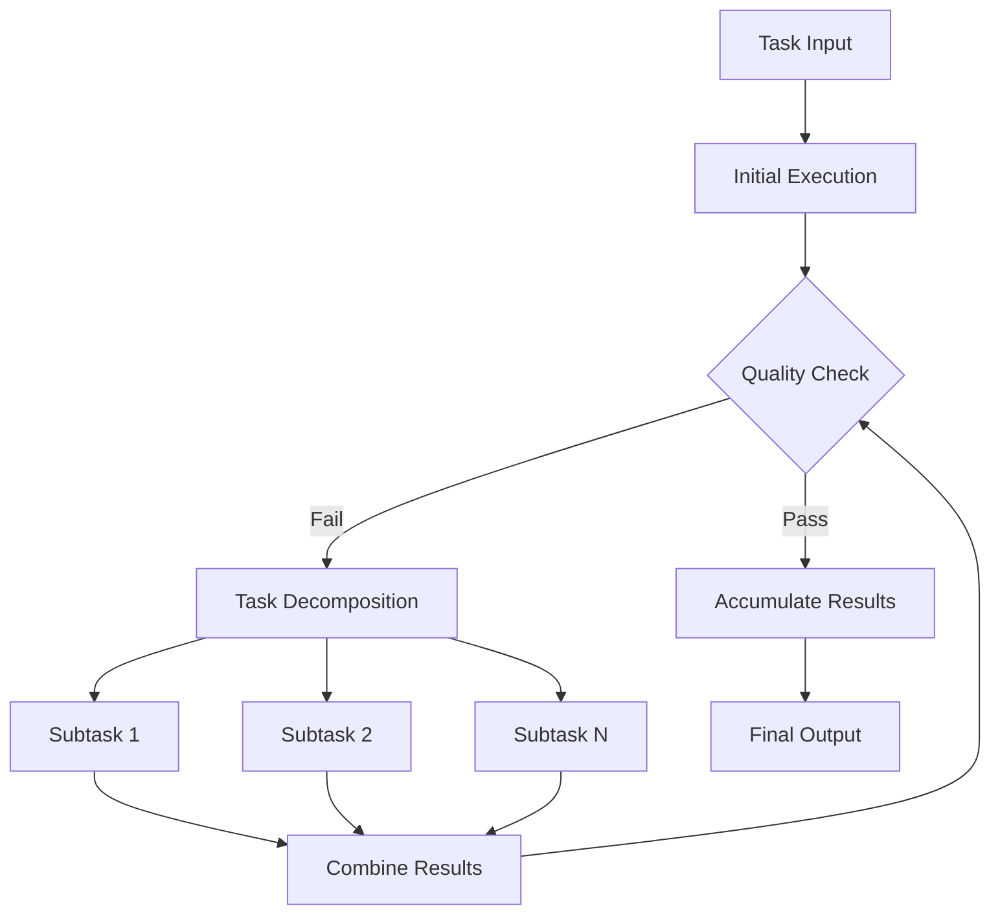

Here's the revised README.md that accurately reflects the current system architecture and functionality:

# SeqCV

## System Overview

SeqCV is a sophisticated task execution framework that employs recursive decomposition and multi-agent collaboration to handle complex tasks. The system features:

- **Recursive task decomposition** for handling complex objectives
- **Multi-model fallback** mechanism with primary and backup LLM clients
- **Quality-controlled execution** with iterative refinement
- **Result accumulation** across recursive levels and agent rounds

## Architecture Flow



## Execution Process

1. **Task Initialization**
   - Receives objective (e.g., "Write comprehensive AI report")
   - Configures primary and fallback LLM clients

2. **Initial Execution Phase**
   - Multiple AI agents attempt task completion in parallel
   - Primary LLM client (configurable) handles initial request
   - Automatic fallback to alternative models if primary fails

3. **Quality Validation**
   - Output evaluated against completion criteria:
     * Content completeness
     * Relevance to objective
     * Structural integrity
   - Pass: Proceeds to result accumulation
   - Fail: Triggers recursive decomposition

4. **Recursive Decomposition**
   - System SeqCVks task into logical subtasks:
     * Subtask 1 (e.g., "AI historical development")
     * Subtask 2 (e.g., "Current applications")
     * Subtask N (e.g., "Emerging trends")
   - Each subtask repeats the execution cycle

5. **Result Handling**
   - **Per-round accumulation**: Agents append new content each round
   - **Cross-agent selection**: Best result chosen via `_select_best_result`
   - **Recursive accumulation**: Results propagate through call stack via `accumulated_result` parameter

6. **Termination Conditions**
   - Successful completion (`_is_task_complete` returns True)
   - Maximum recursion depth reached
   - All fallback options exhausted

## Key Features

### Multi-Model Resilience
```python
self.llm_configs = [
    {"provider": "openai", "model": Config.GPT_MODEL},  # Primary
    {"provider": "openrouter", "model": "meta-llama/llama-3.1-8b-instruct:free"},  # Fallback 1
    {"provider": "openrouter", "model": "mistralai/mistral-7b-instruct:free"}  # Fallback 2
]
```

### Recursive Result Accumulation
1. **Hierarchical Preservation**:
   - Each recursion level receives parent's `best_result` as `accumulated_result`
   - Final output contains concatenated results from all levels

2. **Round-Level Aggregation**:
   ```python
   combined_result = f"{current_results[agent_id]}\n{new_text}".strip()
   ```
   - Maintains complete execution history within each recursion level

3. **Quality-Based Selection**:
   - Employs weighted scoring across multiple dimensions
   - Only highest-quality results propagate through recursion

## Implementation Notes

- **JSON Processing**: Robust handling with comment stripping and validation
  ```python
  cleaned_json_str = re.sub(r'//.*?$|/\*.*?\*/', '', context, flags=re.MULTILINE)
  ```

- **Logging**: Comprehensive execution tracing
  - Dual output (console + file)
  - Detailed LLM response logging
  - Fallback attempt records

- **Customization Points**:
  - `Config.GPT_MODEL`: Primary model selection
  - `Config.TEMPERATURE`: Creativity control
  - `prompt.INIT_SeqCVKDOWN_PROMPT`: Task decomposition template

## Result Characteristics

The final output inherently:
- Contains all validated intermediate results
- Preserves the highest-quality contributions from each agent
- Maintains logical structure through recursive composition

For concise outputs, implement post-processing to:
1. Remove duplicate content
2. Filter intermediate artifacts
3. Apply final stylistic polish